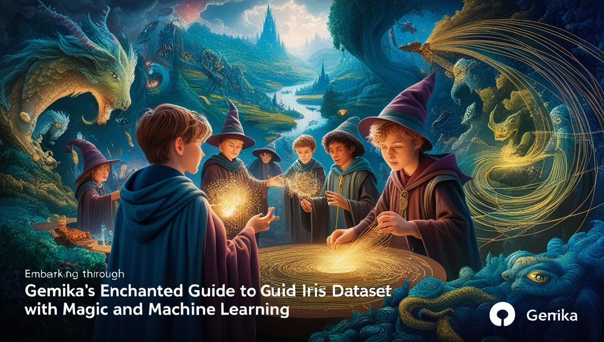

# Gemika’s Enchanted Guide to Iris Dataset with Magic and Machine Learning 🌟🧙‍♂️



> "Ah, to wield magic is one thing, but to wield data with the might of machine learning? Now that's true wizardry!" - Professor Dumbledore (probably).

Welcome, young witches and wizards of data science, to the enchanted halls of **Gemika's Guide to the Iris Dataset!** Whether you’re a Muggle just stepping into the world of Machine Learning or an experienced wizard looking to brush up on your spellbook, this repository will guide you through the mystical art of Exploratory Data Analysis (EDA) and Machine Learning using the legendary **Iris Dataset**.

Brew your potions (a.k.a. Python scripts), wave your wands (a.k.a. Jupyter Notebooks), and prepare for a journey into the magical realm of data! 🧙‍♂️🌟

## 🔗 Table of Contents (Click to Apparate!)

- [📚 Introduction](#-introduction)
- [💊 Prerequisites (Tools & Ingredients)](#-prerequisites-tools--ingredients)
- [👩‍🎓 Installation Guide (Summoning Your Tools)](#-installation-guide-summoning-your-tools)
  - [🌬️ Installing Python](#-installing-python)
  - [🎨 Creating a Virtual Environment](#-creating-a-virtual-environment)
  - [🛠️ Installing the Magical Libraries](#-installing-the-magical-libraries)
  - [🧠 Summoning Jupyter Lab](#-summoning-jupyter-lab)
- [🧙‍♀️ The Journey Through the Iris Dataset](#-the-journey-through-the-iris-dataset)
- [🎩 Final Words of Wisdom](#-final-words-of-wisdom)
- [📜 Full Tutorial Series](#-full-tutorial-series)

---

## 📚 Introduction

Machine learning, much like the art of spellcasting, requires patience, practice, and a deep understanding of the arcane forces at work. But fret not! This repository serves as your very own **Hogwarts for Data Science**, where you will master the fundamental spells (Python techniques) needed to tame the **Iris Dataset**, one of the most famous datasets in the enchanted archives of Machine Learning.

By following this guide, you will:
- Explore the Iris Dataset with **pandas, matplotlib, and seaborn**.
- Summon insights using **EDA techniques**.
- Enchant your data with **machine learning models using scikit-learn**.
- Discover the magic of **classification models**.

Now, without further ado, let’s get your wizarding setup ready! 🧙‍♂️📚

---

## 💊 Prerequisites (Tools & Ingredients)

Before we embark on our adventure, you must first gather the following mystical ingredients:

- A **wand** (a.k.a. a computer 💻)
- A **cauldron** (a.k.a. Python installed on your machine 🧟‍♂️)
- A **spellbook** (a.k.a. Jupyter Notebook)
- An unquenchable thirst for knowledge 🚀

Now, let’s get everything set up!

---

## 👩‍🎓 Installation Guide (Summoning Your Tools)

### 🌬️ Installing Python

The first step to harnessing the power of machine learning is installing **Python** (version 3.8+ recommended). Choose your OS and follow the appropriate spell:

- **Windows**: Download Python from [python.org](https://www.python.org/downloads/) and install it. Remember to check the **"Add Python to PATH"** box during installation!
- **MacOS**: Open **Terminal** and run:
  ```sh
  brew install python
  ```
- **Linux**: Use:
  ```sh
  sudo apt install python3
  ```

Verify the installation:
```sh
python --version
```
If you see something like `Python 3.x.x`, then congratulations, young wizard! You’ve successfully tamed the Python beast. 🐍

---

### 🎨 Creating a Virtual Environment

To keep your spells organized, it's best to work within a **virtual environment**:

```sh
python -m venv venv
```

Activate it:
- **Windows**: `venv\Scripts\activate`
- **MacOS/Linux**: `source venv/bin/activate`

You should now see `(venv)` appear in your terminal. This means you're inside your magical environment! 🫡

---

### 🛠️ Installing the Magical Libraries

With the environment set up, install the required libraries by casting the following spell:

```sh
pip install -r requirements.txt
```

This installs all the potions (a.k.a. packages) needed for our magical journey! 🎩

---

### 🧠 Summoning Jupyter Lab

To open **Jupyter Lab**, our spellcasting parchment, use:
```sh
jupyter lab
```
This will open a new tab in your browser where you can start casting Python spells! 🔮

---

## 🧙‍♀️ The Journey Through the Iris Dataset

Once inside **Jupyter Lab**, open the notebook files from this repository and embark on an adventure through the mystical realm of **EDA and ML with the Iris Dataset**. You will:
- Visualize the dataset with beautiful plots.
- Uncover hidden patterns within the dataset.
- Build an ML model that classifies the different Iris species.

Be sure to read each cell carefully and execute them in order. Each line of code is a step deeper into the magical forest of Data Science! 🌿

---

## 🎩 Final Words of Wisdom

Congratulations, young data wizard! You are now equipped with the knowledge to explore the enchanted world of machine learning.

But remember, **learning never ends**. Continue practicing, experimenting, and refining your spells (code). Even the greatest wizards of our time—Dumbledore, McGonagall, and Merlin—were once beginners.

If you ever find yourself lost, seek guidance from the **full tutorial series** linked below!

---

## 📜 Full Tutorial Series

For an even **more immersive** experience, follow the **full tutorial series** on Dev.to:

📚 [Read the Full Guide Here](https://dev.to/gerryleonugroho/series/30657)

---

May your models always predict with high accuracy, and may your datasets always be balanced! 🧙‍♀️🌈
