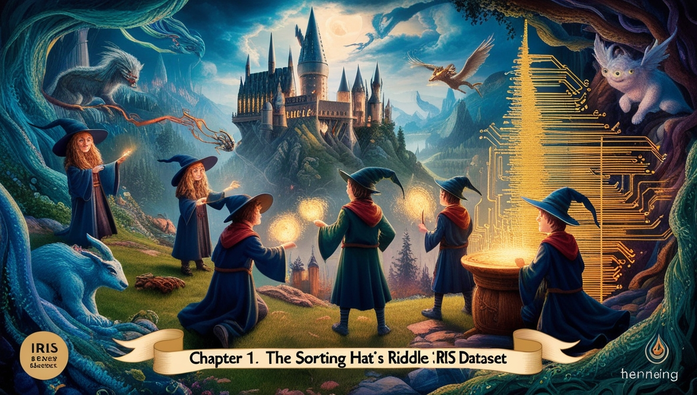

# 🌿 Gemika's Enchanted Guide to the Iris Dataset: Magic & Machine Learning 🌟



Welcome, young sorcerers and data enthusiasts, to a realm where magic meets machine learning! 🧠💡 In this enchanted guide, we shall embark on a wondrous journey through the mystical lands of Python, Exploratory Data Analysis (EDA), and the magical art of Machine Learning – all using the fabled **Iris dataset**.

A gentle breeze whispers through the petal-laden fields of Iris flowers, each blossom holding secrets waiting to be unraveled by your newfound powers. Are you ready to conjure insights and predictions with a few incantations (a.k.a Python scripts)? Then step forth, dear wizard, and let the magic unfold! 🌿💧

---

## ✨ Table of Contents ✨

1. **Introduction 🎩**
2. **Summoning the Tools ⚙️**
3. **Exploring the Iris Realm (EDA) 🌿**
4. **Conjuring Machine Learning Spells 🧙‍♂️**
5. **Predictions & Enchanted Insights 💡**
6. **Final Words from the Grandmaster 🌟**
7. **Contribute & Join the Guild 🧪**

---

## 🎩 Introduction

Before us lies the **Iris dataset**, one of the most famous datasets in the land of Machine Learning. It contains records of three species of the Iris flower, with petal and sepal dimensions meticulously noted by wise botanists of old. Our quest? To uncover patterns, wield predictive spells (models), and ultimately, classify these magical blooms with precision.

And fear not! This guide is crafted for beginners, so even if you've never whispered a line of Python before, you'll soon be casting spells with ease. 🚀

---

## ⚙️ Summoning the Tools

Every great wizard needs a **wand**. In our case, Python shall be our instrument of sorcery! But before we embark on our journey, we must gather our enchanted artifacts:

### **Install the Magic Tomes (Libraries)**

Ensure your spellbook (a.k.a Python environment) is prepared with the necessary scrolls:
```bash
pip install numpy pandas matplotlib seaborn scikit-learn
```
These incantations will allow us to manipulate data, visualize patterns, and perform our machine-learning magic. 🎩

---

## 🌿 Exploring the Iris Realm (EDA)

A wise sorcerer first **observes** before casting spells. We must delve into the dataset and discover its secrets.

### **Peering into the Dataset**
Let's load the data and take our first glance:
```python
import pandas as pd
from sklearn.datasets import load_iris

data = load_iris()
df = pd.DataFrame(data.data, columns=data.feature_names)
df['species'] = data.target_names[data.target]
print(df.head())
```
With a simple spell, we reveal the first few rows, whispering the names of Iris Setosa, Iris Versicolor, and Iris Virginica. 🌿

### **Visualizing the Magic**
To truly understand our flowers, we shall invoke the power of **Seaborn** to create stunning visualizations:
```python
import seaborn as sns
import matplotlib.pyplot as plt

sns.pairplot(df, hue='species', markers=['o', 's', 'D'])
plt.show()
```
As if by magic, a colorful tapestry of patterns emerges, showing how each flower species differs from the others. 💐

---

## 🧙‍♂️ Conjuring Machine Learning Spells

Now, the moment we've been preparing for! Let’s build a **classification model** to predict the species of a flower based on its petal and sepal measurements.

### **Splitting the Dataset**
Before casting our predictive spell, we must split our dataset:
```python
from sklearn.model_selection import train_test_split
X = df.drop(columns=['species'])
y = df['species']
X_train, X_test, y_train, y_test = train_test_split(X, y, test_size=0.2, random_state=42)
```
Our data is now divided, ready for training and testing. 💡

### **Summoning the Guardian: Decision Tree**
A **Decision Tree** shall be our first spell of choice:
```python
from sklearn.tree import DecisionTreeClassifier
from sklearn.metrics import accuracy_score

clf = DecisionTreeClassifier()
clf.fit(X_train, y_train)
y_pred = clf.predict(X_test)
print(f'Accuracy: {accuracy_score(y_test, y_pred):.2f}')
```
With a flick of our wand, the model is trained, and its accuracy is revealed. Was the spell successful? Did our model classify the flowers correctly? 🌟

---

## 💡 Predictions & Enchanted Insights

Let’s test our model with a new, unseen flower!
```python
new_flower = [[5.1, 3.5, 1.4, 0.2]]  # A mysterious bloom
prediction = clf.predict(new_flower)
print(f'This flower is an enchanted {prediction[0]}!')
```
With this final spell, the secrets of the unknown bloom are unveiled. 🌿

---

## 🌟 Final Words from the Grandmaster

Congratulations, young mage! You have successfully wielded the power of **Exploratory Data Analysis** and **Machine Learning** to classify flowers with wizard-like accuracy. But this is merely the beginning.

From here, you can:
- Experiment with other models like **Random Forest** or **SVM**.
- Tune hyperparameters for better accuracy.
- Explore real-world datasets and cast even greater spells. 🎩

---

## 🧪 Contribute & Join the Guild

The spellbook is never truly complete! If you wish to contribute, improve, or expand this magical guide, feel free to:

1. **Fork the repository**
2. **Raise issues** if you spot an error in the incantations
3. **Add new spells (features) and submit a pull request**

Join the magical community and help future wizards learn the ways of **Machine Learning Sorcery**! 🦜🌟

---

### 🌿 Explore the Full Tutorial Series
For a deeper dive into this enchanted world, visit the **full tutorial series** here: [The Full Guide](https://dev.to/gerryleonugroho/series/30657).

May your models be ever accurate and your predictions as clear as a crystal ball! 🎩💚
